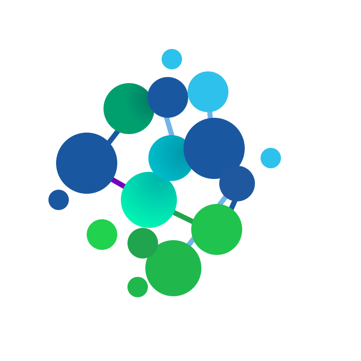

# Release Operate Report

## What is ROR

ROR is a vendor-agnostic eco-system for resources.
For more detailed explanation see [here](https://norskhelsenett.github.io/ror/).

# Documentation

The documentation is automatically built and available at [norskhelsenett.github.io/ror](https://norskhelsenett.github.io/ror/), see it for more detailed information.

For more information about the documentation see [here](https://norskhelsenett.github.io/ror/documentation/).

# ROR Eco-System

For a complete list and more information see [here](https://norskhelsenett.github.io/ror/components/core/#Repositories).

The ROR ecosystem is made out of multiple repositories to separate each major component.
Other components such as microservices and "addons" are also separated out to be a clear distinction between what is ROR and what is an implementation of a resource to ROR.
A complete list can be found [here](https://norskhelsenett.github.io/ror/components/)

# Features

# Installation

For a local installation see [here](https://norskhelsenett.github.io/ror/development/setup/).
For a kubernetes installation see [here](https://norskhelsenett.github.io/ror/installation/).

## Installation from source

See [BUILD.md](https://github.com/NorskHelsenett/ror-api/blob/main/README.md) and [supported platforms](https://github.com/NorskHelsenett/ror-api/blob/main/README.md) for details.

The build is CMake-based, but a Makefile is provided as a convenience.

# Project layout

```
├─ charts/                 helm charts for the entire ROR eco-system
├─ cmd/                    executable files related to the ROR Core
│  ├─ docs/                contain dockerfile and doc automation
│  ├─ generator/           starts the generator to generate files
├─ docs/                   documentation for the mkdocs
├─ hacks/                  files for local development environment
│  ├─ assets/              TODO
│  ├─ data/                Mix of configuration files and container mounts.
│  ├─ scripts/             various scripts for mocking k8s cluster, mongodb, etc.
├─ media/                  various media (pictures, videos, etc) of ror
├─ pkg/                    various subsectioned parts of ror
│  ├─ apicontracts/        TODO
│  ├─ auth/                authorization packges, ldap, ad, userauth, etc.
│  ├─ clients/             various clients
│  ├─ config/              TODO
│  ├─ context/             TODO
│  ├─ handlers/            TODO
│  ├─ helpers/             TODO
│  ├─ kubernetes/          TODO
│  ├─ messagebuscontracts/ TODO
│  ├─ models/              various models used in the ror eco-system
│  ├─ rlog/                logging package used in the ror eco-system
│  ├─ rorresources/        resource, resourcetypes, api, etc. definitions. TODO
│  ├─ services/            TODO
│  └─ telemetry/           telemetry (metrics, trace) package used
├─ typescript/             generated typescript based on Go code for frontend
├─ mkdocs-requirements.txt requirements for bringing up mkdocs.
├─ mkdocs.yml              mkdocs navigation paths.
└─ r.sh                    starting script, copies files and start docker environment
```

# License

See [LICENSE](https://github.com/NorskHelsenett/ror/blob/main/LICENSE)

# Run ROR?

See [ROR-API README](https://github.com/NorskHelsenett/ror-api/blob/main/README.md) for more information on how to bring up a development environment.
