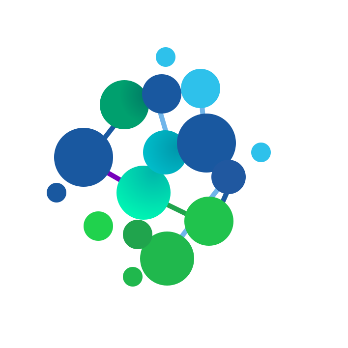

# Release Operate Report

```
"ror" is the Norwegian word for rudder.
A rudder is a control device where a blade or a fin is attached to a shaft.
This is used to change the direction of a force in a fluid or gas.
Rudders are most commonly used on boats, ships, and aircraft.
```

ROR is a multi cluster management tool aimed to streamline the process of creating kubernetes clusters on any provider or architecture.
ROR is developed by Norsk Helsenett SF but we move to remove any references and internal logic related to the organization. Our aim is to release the project as an open source project.

## API driven

ROR is API driven with provided web and cli clients. ROR leverages the Kubernetes API definition extending it with additional metadata and resources.

## Provider agnostic but extensible

ROR is aimed to be provider/cloud agnostic but stil extensible to provide provider specific functionality by the use of microservices.

## Distributed model

ROR relies on a distributed model using agents in each cluster. This model ensures that ROR cant be used to access the cluster directly.

## Development values

-   Support simple primitives first then extend support if needed.
-   Collect only needed data, scope the datamodel to suit our need.

## Features

### Release

| function              | milestone | done | description                                                                                               |
| --------------------- | --------- | ---- | --------------------------------------------------------------------------------------------------------- |
| create cluster        | 1.0       | 90%  | Create cluster from sclusterspec, allows integration with other teams managementssolution.                |
| upgrade/scale cluster | 1.0       | 20%  | Upgrade/scal cluster from changing sclusterspec, allows integration with other teams managementssolution. |
| decomission cluster   | 1.0       | 20%  | Decomission cluster, allows integration with other teams managementssolution.                             |

### Operate

| function                 | milestone | done               | description                                                       |
| ------------------------ | --------- | ------------------ | ----------------------------------------------------------------- |
| cluster inventory        | 1.0       | :heavy_check_mark: | Collect basic clustrerinformation                                 |
| cluster status           | 1.0       | :heavy_check_mark: | Calculate healthscore for the cluster based on established rules. |
| Configuration management | 1.0       |                    |                                                                   |
| - Dex integrations       | 1.0       | :heavy_check_mark: | Automatic provisioning of dex clientid and clientsecrets          |
| - tooling-config         | 1.0       | 90%                | Full config of tooling from ROR                                   |
| - Authorization          | 1.0       | :heavy_check_mark: | Configure access to clusters from ROR                             |

### Report

| function        | milestone | done               | description                                                         |
| --------------- | --------- | ------------------ | ------------------------------------------------------------------- |
| - Metrics       | 1.0       | :heavy_check_mark: | Gather basic cluster metrics                                        |
| - Security scan | 1.0       | :heavy_check_mark: | Run scans of cluster components like config, images certificates... |
